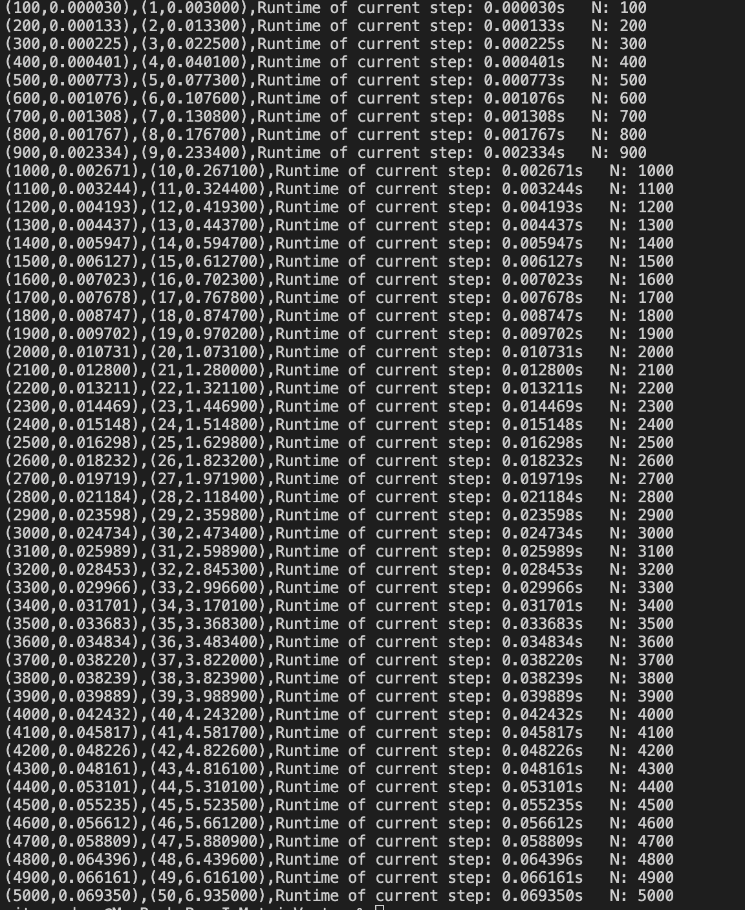
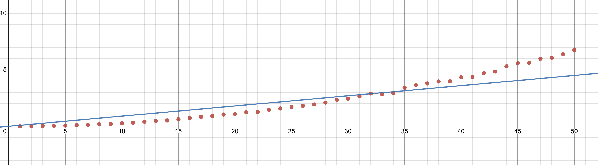

# Matrix and Vector Multiplication

## How to run

### Command:

To run main_test.c

```bash
make; ./main.out
```

To run main_b_time.c

```bash
make time
```

To run main_b_space.c

```bash
make space
```

# Time Complexity

For the time complexity, it will show how long did it take the program to run the script


Below is the graph:


# Space Complexity

For the space complexity, it will run forever loop within the program.
these files are executed 3 times each with different input values N = 2000 and N = 1000


Below is the graph:

